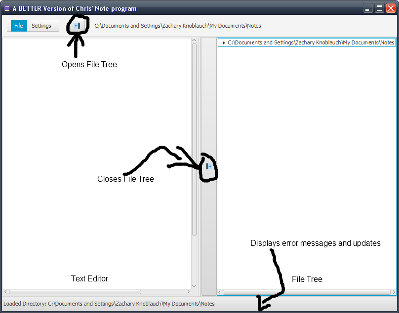
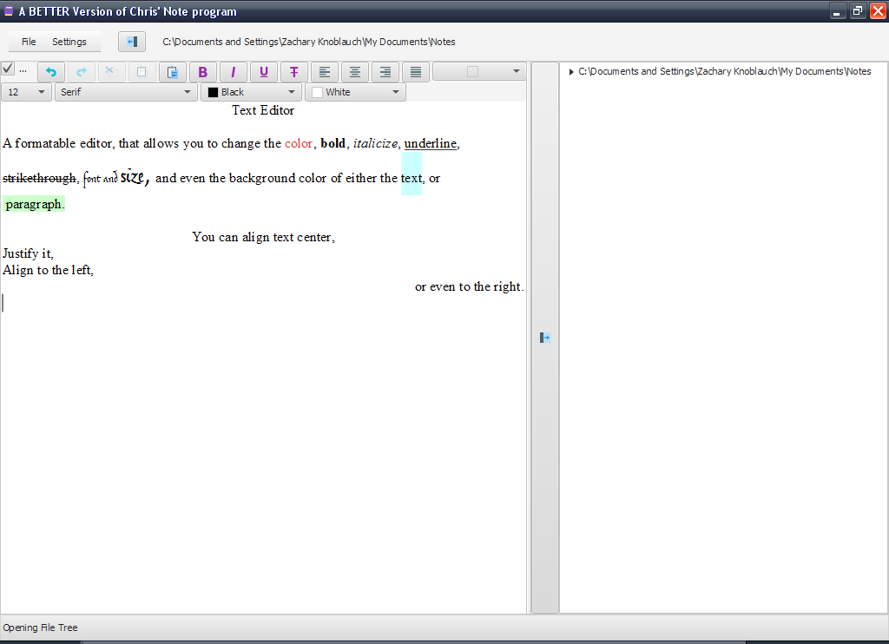

# NoteViewer

A *BETTER* version of a friend's batch note viewer

#A Brief Look
 The NoteViewer program allows you to view a file tree, and the text editor at the same time. Allowing you to switch and swap between files at ease. 
 
Version 1.0
 
 
 
Version 1.1

 

 

# Features
1. File Tree (Needs more work, as in it only shows files, not selecting happens)
2. Text Editor (Ability to save formatted work, non existant. Needs work)
3. Ability to close/open File Tree at ease
4. Ability to switch working directory, and other settings (Yet to be implemented)
5. Added Easter Eggs (Total: 2)